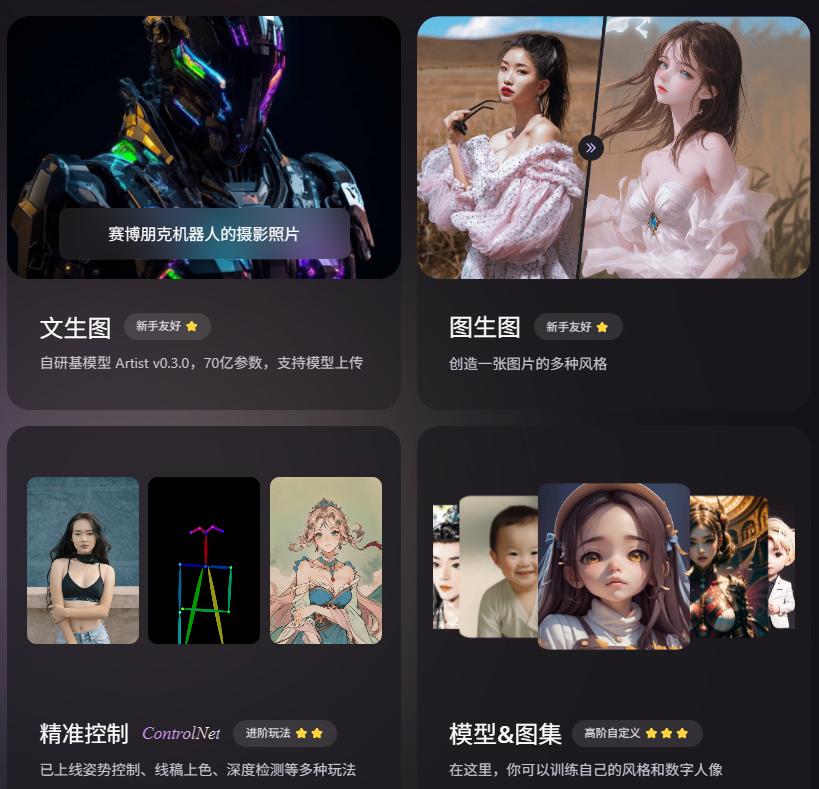
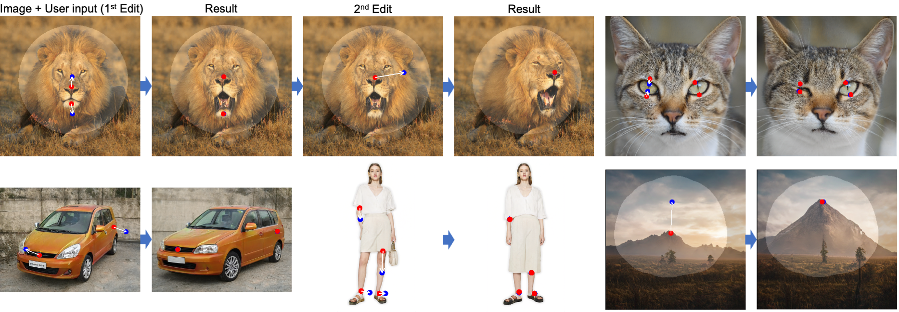
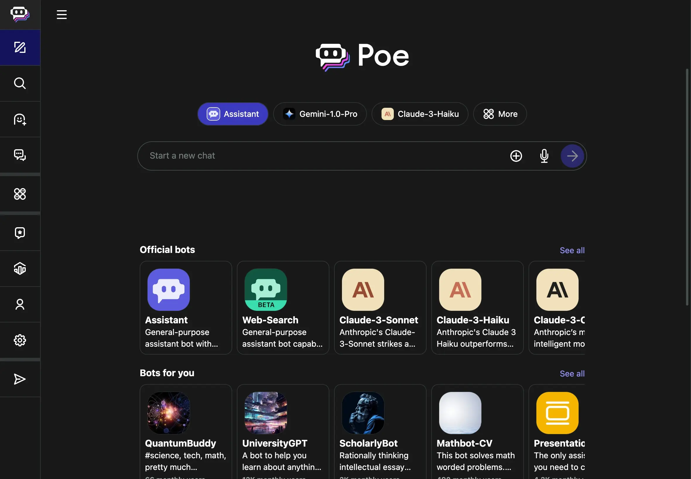
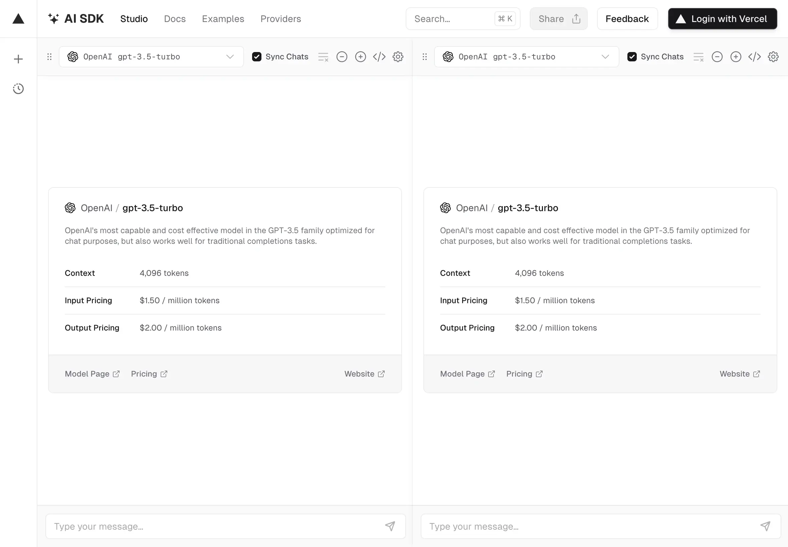
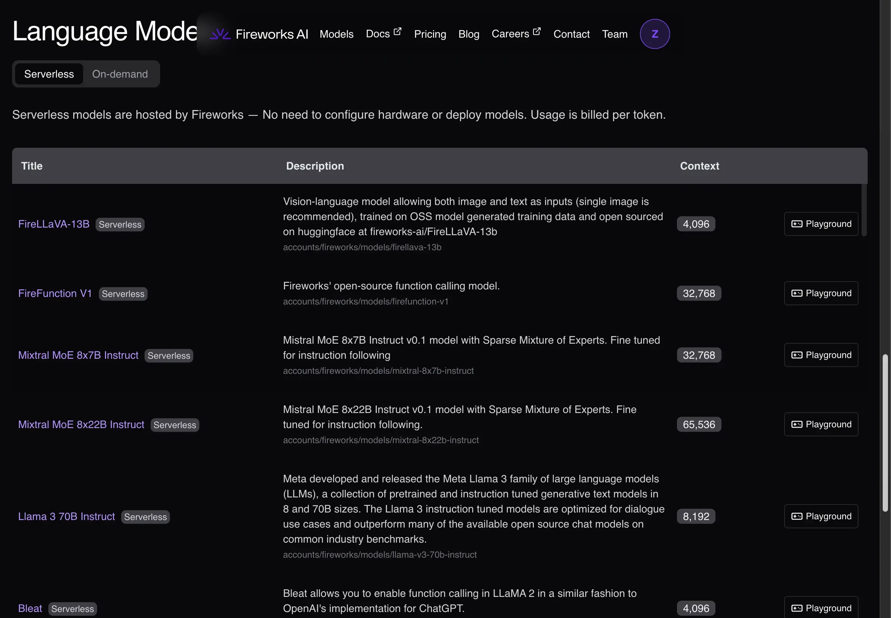
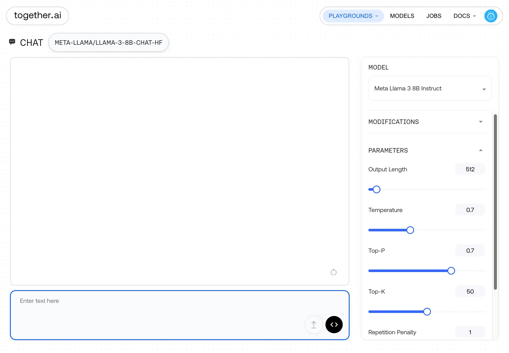
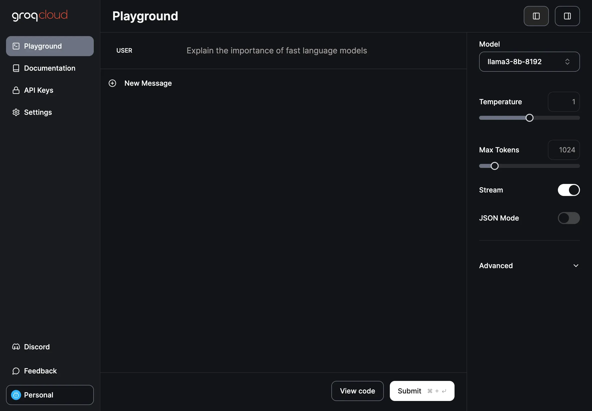
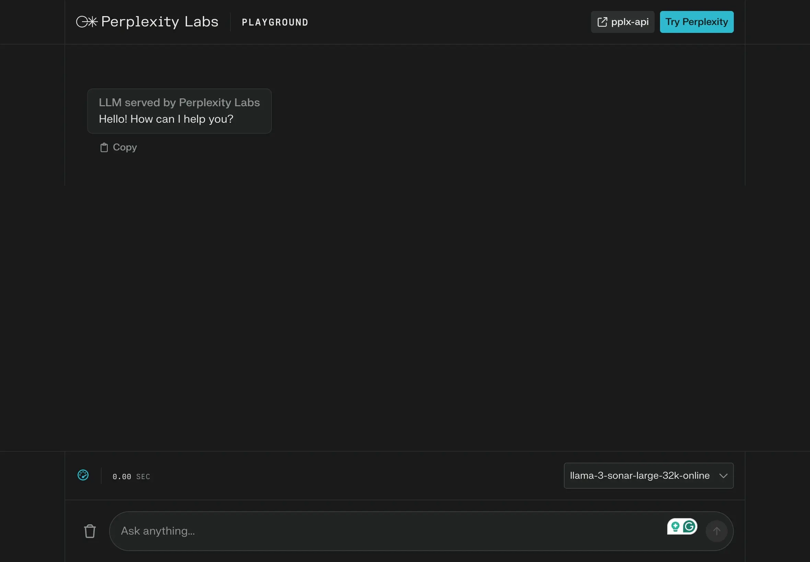

# AIGC商店

+ [ikaijua/Awesome-AITools](https://github.com/ikaijua/Awesome-AITools)

+ [AIGC工具导航 | 生成式人工智能GAI - AI应用工具导航平台！](https://www.aigc.cn/)

+ [AIHub - 免费齐全的AI工具箱 | 精选800+AI工具集合网站导航](https://www.aihub.cn/)

+ [AI Tools: The Best All in One New AI Tool Platform (aitoolmall.com)](https://aitoolmall.com/)

+ [‌‬⁡⁡‍⁢⁤‬‌‬⁣‍‍⁣⁡⁤‌⁢⁡⁡‍‍‬⁢‍⁣⁡‌‌⁡⁣# AI 产品案例严选 - 飞书云文档 (feishu.cn)](https://aiweaver.feishu.cn/wiki/VsPWwY5VJi3BOTkMimPcWQaRnJe)

# GPT

[数字玩家 (opkfc.com)](https://www.opkfc.com/list)

OPKFC.com 提供免费的 ChatGPT 账号链接，让用户可以访问和使用不同的 ChatGPT 版本。用户可以选择不同的账号链接以便在繁忙时段仍能使用这些 AI 工具。

# 模型空间

+   [Hugging Face – The AI community building the future.](https://huggingface.co/)
+ [概览 · 魔搭社区 (modelscope.cn)](https://www.modelscope.cn/my/overview)
+ [SwanHub - 创新的AI开源社区](https://swanhub.co/)

## replicate

[Replicate — Run AI with an API](https://replicate.com/)

Replicate 是一个平台，允许用户通过简单的 API 调用运行和微调开源 AI 模型。它支持图像生成、文本生成、图像描述、音乐和语音生成等多种 AI 应用。用户可以使用该平台快速部署开源模型，也可以上传自己的定制模型进行大规模部署。Replicate 提供按需计费的 GPU 计算资源，帮助用户在不需要管理复杂基础设施的情况下轻松扩展 AI 项目。

# api平台

## AIHubMix

[AIHubMix](https://github.com/euansu/AIHubMix)

---

[智谱AI开放平台 (aminer.cn)](https://maas.aminer.cn/)

## SiliconFlow

[SiliconFlow, Accelerate AGI to Benefit Humanity](https://siliconflow.cn/zh-cn/)

10B以下的模型都是免费的

[【官网】302.AI - 汇集全球顶级品牌的AI超市，零月费，按需付费，全面开放](https://302.ai/)

# 文字

## screenpi

[mediar-ai/screenpipe: 24/7 local AI screen & mic recording. Build AI apps that have the full context. Works with Ollama. Alternative to Rewind.ai. Open. Secure. You own your data. Rust. (github.com)](https://github.com/mediar-ai/screenpipe)

Screenpipe 是一个开源的 24/7 本地屏幕和麦克风录制工具，旨在帮助开发者构建 AI 应用，利用用户所见、所说和所听的全部上下文数据。它支持 Ollama 并作为 Rewind.ai 的替代品，确保数据开放、安全且完全由用户拥有。该项目基于 Rust 开发，具有插件系统，允许扩展功能，还提供桌面应用和命令行工具，适用于不同平台和用户需求。

## GOT-OCR2.0

GOT-OCR2.0 是一项通用 OCR 理论的官方代码实现，旨在通过统一的端到端模型提升 OCR 技术。它整合了多种 OCR 功能，包括处理普通文本、格式化文本、细粒度文字识别、多页、多裁剪等，并支持快速微调和训练。该模型基于大型视觉语言模型，可用于各种文本识别任务，尤其在复杂场景和多种语言环境中表现出色。代码和权重文件公开，并提供了 Hugging Face 和 Modelscope 等平台上的部署示例。

更多信息请参考 [GOT-OCR2.0](https://github.com/Ucas-HaoranWei/GOT-OCR2.0)。

## LLM-Aided OCR

[Dicklesworthstone/llm_aided_ocr: Enhance Tesseract OCR output for scanned PDFs by applying Large Language Model (LLM) corrections. (github.com)](https://github.com/Dicklesworthstone/llm_aided_ocr)

LLM-Aided OCR是一个旨在提升PDF文档OCR质量的项目，采用LLM技术显著改善效果。该项目包括PDF转换、OCR文本提取、文本分块、错误校正、可选的Markdown格式化和质量评估，支持本地和云LLM以及异步处理。

# 图

## 设计

### Ideogram

[Ideogram](https://ideogram.ai/) 是一个基于 AI 技术的图片生成平台，用户通过输入文字提示即可生成多种视觉内容。该平台能够创建艺术性强、富有创意的图像，适用于设计、插画等领域。它通过先进的 AI 模型，理解用户的指令，并生成独特的视觉作品。

### 矢量图Recraft V3 

https://www.recraft.ai/

Recraft V3 是 Recraft 公司最新推出的 AI 图像生成模型，具备以下特色功能：

1. **强大的文本渲染能力**：能够准确生成包含长文本的图像，确保文本内容清晰可读。
2. **精准的人体结构生成**：在生成人物图像时，能正确呈现手指、脚趾等细节，避免肢体扭曲变形。
3. **准确的提示词理解**：对复杂提示词有出色的理解能力，能精确生成提示中指定的物体数量、颜色和位置。
4. **高水平的风格审美**：生成的图像在美学质感上媲美 Midjourney，风格多样且质感出色。

此外，Recraft V3 还提供专为设计师打造的四大功能：

- **定位排版设计**：通过参考图像生成相似构图的新图像，方便设计师进行精准控制。
- **风格训练迁移**：用户可上传多张图像，训练生成自定义风格，应用于后续图像生成中。
- **矢量图像生成**：支持通过文本生成不同风格的矢量图形，并可将位图转换为可编辑的矢量格式。
- **AI 样机功能**：提供多种样机模板，用户可将设计稿与样机融合，快速生成高质量的展示图。

这些功能使 Recraft V3 成为设计师的强大工具，提升创作效率和作品质量。

## Stable Diffusion 3

[Stable Diffusion 3免费在线访问- 由SD3 API提供支持](https://stablediffusion3.net/zh-CN)

## KREA.ai

[KREA AI - Enhancer](https://www.krea.ai/home)

Krea AI 是一个 AI 智能设计工具，功能包括文生图、AI pattern、Logo Illustration 以及 AI 模型训练等，它因为实时生成（Real-time Generation）功能而备受瞩目。

## 海报

[AIGText/Glyph-ByT5: This is an official inference code of the paper "Glyph-ByT5: A Customized Text Encoder for Accurate Visual Text Rendering" and "Glyph-ByT5-v2: A Strong Aesthetic Baseline for Accurate Multilingual Visual Text Rendering"" (github.com)](https://github.com/AIGText/Glyph-ByT5)

## ARC

[ARC官网-腾讯 (tencent.com)](https://arc.tencent.com/zh/ai-demos/faceRestoration)

人像修复

人像抠图

动漫增强

万物识别

多模态理解和生成

## 万象生图

[万象生图 (qq.com)](https://support.qq.com/products/637894/)

Windows 桌面软件，可以在日常电脑上运行的快速文生图模型，无需 GPU 和 Python。

## krita+comfyui

[Acly/krita-ai-diffusion: Streamlined interface for generating images with AI in Krita. Inpaint and outpaint with optional text prompt, no tweaking required. (github.com)](https://github.com/Acly/krita-ai-diffusion)

结合Krita的强大绘画功能和ComfyUI的图像处理能力，实现高效的数字绘画和图像优化工作流。

[krita comfyui-哔哩哔哩_bilibili](https://search.bilibili.com/all?keyword=krita+comfyui&from_source=webtop_search&spm_id_from=333.1296&search_source=5)

## 超分辨率

[Fanghua-Yu/SUPIR: SUPIR aims at developing Practical Algorithms for Photo-Realistic Image Restoration In the Wild (github.com)](https://github.com/Fanghua-Yu/SUPIR)

[upscayl/upscayl: 🆙 Upscayl - #1 Free and Open Source AI Image Upscaler for Linux, MacOS and Windows. (github.com)](https://github.com/upscayl/upscayl)

## 编辑

https://www.stylar.ai/

+ 最可控的AI图像与设计工具
+ 功能全面、操作简单，适用于多个场景。
+ 包括背景移除、添加/删除对象、2D到3D、背景修改等功能。
## VASA-1

通过上传一段语音给图片加上逼真的口型和表情

[VASA-1 - Microsoft Research](https://www.microsoft.com/en-us/research/project/vasa-1/)

## stable diffusion

网页版：[DreamStudio](https://beta.dreamstudio.ai/generate)

## ClipDrop

一个AI图像工具网站，提供多种工具来增强图像和创建惊人的视觉效果

可以免费体验

[clipdrop.co/tools](https://clipdrop.co/tools)

## 妙画

https://miaohua.sensetime.com/

特点：

+ 文生图
+ 图生图
+ 线稿上色
+ ControlNet
  + 语义分割
  + 姿势控制
  + 边缘控制
  + 柔性边缘控制
  + 深度控制
  + 涂鸦
  + 法线控制
  

 

## DragGAN

[XingangPan/DragGAN: Official Code for DragGAN (SIGGRAPH 2023) (github.com)](https://github.com/XingangPan/DragGAN) 

[Drag Your GAN: Interactive Point-based Manipulation on the Generative Image Manifold (mpg.de)](https://vcai.mpi-inf.mpg.de/projects/DragGAN/)

可以自定义动作

 

## 漫画

Dashtoon Studio是一个创新的在线平台，它利用人工智能（AI）技术简化了漫画创作的过程。这个平台使得用户能够轻松地将他们的故事转换成漫画形式，而且整个过程可以在几分钟内完成。以下是Dashtoon Studio的一些主要特点：

1. **一致的角色设计**：用户可以从Dashtoon的角色库中选择角色，或者创建自己的角色。

2. **多样化的风格选择**：平台提供了多种独特的风格，以适应不同的故事内容。

3. **AI原生工具**：Dashtoon Studio内置了AI工具，可以帮助用户将故事板转换成漫画，去除背景，修复面部表情以及放大和提升图像质量。

4. **发布与盈利**：用户可以通过Dashtoon Reader应用程序发布他们的漫画作品，并通过该平台实现内容的盈利。

5. **创作者计划**：Dashtoon Studio还提供了一个创作者计划，允许创作者加入并盈利于他们的内容，同时触及全球观众。

Dashtoon Studio的目标是让漫画创作变得快速、简单，并且易于上手。它提供了一个快速入门的途径，让用户能够在短时间内制作出自己的第一部Dashtoon漫画。此外，平台还提供了一个YouTube视频教程，帮助用户了解如何使用这个工具，该视频可以通过嵌入的iframe直接观看。

[Dashtoon Studio](https://dashtoon.com/create)

## 贴纸

[StickerBaker | Make AI stickers](https://stickerbaker.com/)

StickerBaker 是一个网站，它允许用户创建人工智能（AI）生成的贴纸。根据提供的网页内容，这个平台似乎专注于将各种图像和设计转换成贴纸，这些贴纸可以用于个性化的聊天应用、社交媒体或其他数字平台上的装饰元素。

用户可以通过这个平台选择不同的主题、风格和设计，然后将其“烘焙”成贴纸，以供个人使用或分享。这种服务对于那些喜欢在聊天和社交媒体中使用个性化贴纸的人来说是非常有趣的。

## 换装

### Kolors Virtual Try-On 

[Kolors Virtual Try-On - a Hugging Face Space by Kwai-Kolors](https://huggingface.co/spaces/Kwai-Kolors/Kolors-Virtual-Try-On)

Kolors-Virtual-Try-On 是一个虚拟试衣应用，允许用户上传自己的照片并试穿不同颜色的服装。它通过人工智能技术，根据用户的照片生成相应的虚拟服装效果，让用户能够直观地看到不同颜色的搭配效果。

## 抠图

[未道帮AI抠图 | 只需上传图片，无需其他操作即可自动去除图片背景，轻松实现一键抠图 (aiwave.cc)](https://cutout.aiwave.cc/)

[Batch Tools](https://images.batchtool.com/)

[Background Removal - a Hugging Face Space by not-lain](https://huggingface.co/spaces/not-lain/background-removal)

## 超分辨率放大

[upscayl/upscayl: 🆙 Upscayl - #1 Free and Open Source AI Image Upscaler for Linux, MacOS and Windows. (github.com)](https://github.com/upscayl/upscayl)

Upscayl是一款开源的AI图像放大工具，适用于Linux、macOS和Windows系统。它通过先进的AI算法（例如Real-ESRGAN）来提升低分辨率图像的质量，将图像放大而不会丢失细节。该工具需要Vulkan兼容的GPU来运行，并且完全免费。

## 人脸修复

[PMRF - a Hugging Face Space by ohayonguy](https://huggingface.co/spaces/ohayonguy/PMRF)

# 游戏

## NVIDIA ACE

[NVIDIA ACE | NVIDIA Developer](https://developer.nvidia.com/ace)

NVIDIA ACE（Avatar Cloud Engine）是一个面向游戏和虚拟世界的对话AI工具集，旨在增强虚拟角色的智能与交互能力。通过ACE，开发者可以创建逼真的对话系统，使虚拟角色能够与玩家进行自然的对话。这个工具集包括自然语言处理（NLP）、文本到语音（TTS）以及语音识别等多种AI技术。ACE利用了NVIDIA的强大计算能力和AI技术，提供云端部署方案，方便开发者在各种设备和平台上实现高质量的对话体验。

## tripo

https://www.tripo3d.ai

Tripo3D是一家提供3D内容生成和虚拟现实体验的平台，利用先进的AI技术帮助用户创建高质量的3D模型和环境。该平台旨在简化3D设计过程，适用于游戏开发、建筑设计、虚拟旅游等多个领域。用户可以通过Tripo3D的工具轻松创建、编辑和分享3D内容，提升设计效率和创意表现。

# 视频

## 文生视频

### 可灵 AI 

[可灵 AI - 新一代 AI 创意生产力平台 (kuaishou.com)](https://klingai.kuaishou.com/)

### MiniMax

[海螺视频-MiniMax旗下产品，引领视频创作变革 (hailuoai.com)](https://hailuoai.com/video)

### CogVideo 

[THUDM/CogVideo: Text-to-video generation: CogVideoX (2024) and CogVideo (ICLR 2023) (github.com)](https://github.com/THUDM/CogVideo)

CogVideo 是由清华大学人工智能研究院（THUDM）开发的一个大规模视频生成模型。它基于GPT-3 结构，是一个多模态预训练模型，能够将文本描述自动转换为视频。CogVideo 在大规模中文和英文文本-视频数据上进行了训练，因此支持中英双语输入。它的主要优势包括生成高质量、具有逻辑连贯性的视频内容，并且可以根据输入文本中的复杂情境生成相应的动态画面。

## 图生视频

### MimicMotion

[Tencent/MimicMotion: High-Quality Human Motion Video Generation with Confidence-aware Pose Guidance (github.com)](https://github.com/tencent/MimicMotion)

MimicMotion 是腾讯推出的一个生成高质量人类动作视频的框架，使用了基于置信度的姿势引导技术。它能够生成任意长度的视频，具备良好的细节和时间连续性。该模型通过大规模训练数据实现了高鲁棒性，并采用区域损失放大和渐进式潜在融合策略，使得生成长时间的视频更平滑。MimicMotion 在视频质量和可控性上较现有方法有显著提升。

### EasyAnimate

[aigc-apps/EasyAnimate: 📺 An End-to-End Solution for High-Resolution and Long Video Generation Based on Transformer Diffusion (github.com)](https://github.com/aigc-apps/EasyAnimate)

EasyAnimate 是一个开源项目，旨在简化生成 AI 动画的过程。它通过结合多个 AI 工具和模型，使用户能够轻松创建角色动画，并生成高质量的动画效果。项目特别适合游戏开发者、内容创作者和动画设计师。用户可以使用该工具对角色进行动画化，而无需深厚的技术背景。

## dream-machine

[Luma Dream Machine (lumalabs.ai)](https://lumalabs.ai/dream-machine)

Luma Dream Machine 是一个基于人工智能的视频生成工具，能够根据文本描述和图像快速创建高质量、逼真的视频。其核心是一个高效的多模态Transformer模型，专门训练来直接生成视频，这使其能够生成物理准确、连贯且富有动作感的场景。

该工具可以通过简单的文本输入和图像，生成具有流畅运动和电影感的复杂视频序列，适合创意工作者和专业人士使用。

## 剪辑

### FunClip

[alibaba-damo-academy/FunClip: Open-source, accurate and easy-to-use video clipping tool, LLM based AI clipping intergrated || 开源、精准、方便的视频切片工具，集成了大语言模型AI智能剪辑功能 (github.com)](https://github.com/alibaba-damo-academy/FunClip)

对视频进行语音识别，随后用户可以自由选择识别结果中的文本片段或说话人，点击裁剪按钮即可获取对应片段的视频。

---

## 换脸

### Deep-Live-Cam

[hacksider/Deep-Live-Cam: real time face swap and one-click video deepfake with only a single image (github.com)](https://github.com/hacksider/Deep-Live-Cam)

Deep-Live-Cam 是一个开源项目，允许用户通过实时面部交换和视频 deepfake 技术来实现动态换脸。它仅需一张图片即可完成操作，并支持通过摄像头进行实时预览。该项目提供 GPU 加速选项，适用于不同的硬件平台（如 NVIDIA、Apple Silicon 等）。开发者特别强调其设计用于合法和道德的应用场景，并内置了过滤机制，避免处理不适当的内容。

### DeepFaceLab

对视频进行换脸

[iperov/DeepFaceLab: DeepFaceLab is the leading software for creating deepfakes. (github.com)](https://github.com/iperov/DeepFaceLab?tab=readme-ov-file)

### DeepFaceLive

实时换脸

[DeepFaceLive](https://github.com/iperov/DeepFaceLive)

## PixVerse

[PixVerse - Create breath-taking videos with PixVerse AI](https://pixverse.ai/)

## Champ

[fudan-generative-vision/champ: Champ: Controllable and Consistent Human Image Animation with 3D Parametric Guidance (github.com)](https://github.com/fudan-generative-vision/champ)

Champ是一种基于3D参数化指导的可控且一致的人体图像动画框架，由南京大学、复旦大学和阿里巴巴集团的研究人员共同开发。该框架旨在实现高质量的人体图像动画，并提供详细的安装、模型下载、推理和示例数据等指导。

## sora

https://openai.com/sora

## Runway

[[Runway - Advancing creativity with artificial intelligence. (runwayml.com)](https://runwayml.com/)](https://runwayml.com/ai-magic-tools/#top)

很火但不开源，有很多功能

[AI Magic Tools | Runway (runwayml.com)](https://runwayml.com/ai-magic-tools/#top)

## LeiaPix

[LeiaPix](https://convert.leiapix.com/)

图片转3d的视频

* 720p的免费

## PIKA LABS

[HOME | Pika Labs](https://www.pika.art/)

可以让图片动起来。生成免费的3s视频。（有水印）

教程：[AI视频生成工具Pika Labs-使用教程 - 知乎 (zhihu.com)](https://zhuanlan.zhihu.com/p/655758031)

## haiper

[Haiper - AI Video Generator](https://app.haiper.ai/explore)

4s视频

## Text2LIVE

视频编辑（类似加滤镜）

[Text2LIVE](https://github.com/omerbt/Text2LIVE)

<iframe src="https://skybox.blockadelabs.com/e/f4bad12b4566386c186ac60728f1d0ff" width=700 height=700 style="border:0;" allow="fullscreen"></iframe>

## 动作

https://viggle.ai/

VIGGLE 是一个基于 JST-1 的平台，它是一个视频-3D 基础模型，具备实际物理理解能力。该平台的主要功能是允许用户控制任何角色按照他们的意愿移动。这意味着用户可以通过 VIGGLE 来创造或操纵3D角色的动作，而这个平台背后支持的技术能够理解并模拟现实世界的物理规则，使得角色的动作更加自然和逼真。简而言之，VIGGLE 提供了一个可以让用户自定义3D角色动作的工具或服务。

## 教学

https://app.gatekeep.ai/

Gatekeep 是一个利用人工智能技术提供个性化学习体验的平台。它的核心功能是将用户的问题转换成引人入胜的教育性解释视频。这个平台强调以下几个特点：

1. **个性化学习**：通过AI技术，Gatekeep 提供真正个性化的学习体验，根据用户的需求和兴趣定制内容。
2. **优质内容与用户体验（UX）**：平台注重内容的质量和用户体验，旨在提供高质量的教育内容和流畅的用户界面。
3. **自然学习过程**：Gatekeep 促进多模态交互，帮助用户以更自然的方式进行学习，提高学习效率。

# 数字人

## awesome-digital-human-live2d

[wan-h/awesome-digital-human-live2d: Awesome Digital Human (github.com)](https://github.com/wan-h/awesome-digital-human-live2d?tab=readme-ov-file)

是一个基于Dify构建的数字人项目，支持Docker'快速部署、Dify服务接入、模块化扩展(包括ASR、LLM、TTS和Agent),以及Live2D人物模型的扩展和控制，适用于PC和移动端web访问。

## LivePortrait

[KwaiVGI/LivePortrait: Bring portraits to life! (github.com)](https://github.com/KwaiVGI/LivePortrait)

LivePortrait是一种高效的人像动画技术，能够通过缝合和重定向控制从单一源图像生成逼真的视频。该技术基于PyTorch实现，优化了运动提取和图像生成模块，支持快速生成高质量的人像动画。项目的代码和预训练模型已在GitHub上公开，提供详细的使用说明和演示视频，适用于多种平台，包括Windows、Linux和macOS。

## AniPortrait

[Zejun-Yang/AniPortrait: AniPortrait: Audio-Driven Synthesis of Photorealistic Portrait Animation (github.com)](https://github.com/Zejun-Yang/AniPortrait)

该项目的目标是利用音频驱动合成逼真的肖像动画。这意味着用户可以仅通过一段音频和一个参考肖像图像来生成动画，或者通过视频来实现面部再现。

# 配音

## Linly-Dubbing

[Linly-Dubbing](https://github.com/Kedreamix/Linly-Dubbing)

Linly-Dubbing是一款自动将视频翻译成多语言并进行AI配音的工具，适用于国际教育和娱乐内容本地化。其特点包括自动下载视频、人声分离、语音识别、LLM翻译、AI语音合成和数字人对口型处理。

## YouDub

[liuzhao1225/YouDub-webui (github.com)](https://github.com/liuzhao1225/YouDub-webui)

 将外语类高质量视频翻译成中文视频，且自动发布在哔哩哔哩，使用tts、AI翻译、 AI 声音克隆等，提供与原视频相似的中文配音

## D-ID

[D-ID | The #1 Choice for AI Generated Video Creation Platform](https://www.d-id.com/)

D-ID 是一家专注于生成式 AI 视频创建的平台。它使用尖端的人工智能技术将静态图像转化为会说话的 AI 视频头像，还提供多语言视频翻译功能。D-ID 的技术广泛应用于市场营销、客户服务、教育等领域，帮助企业通过自然用户界面（NUI）与客户进行更加人性化的互动。公司强调技术的伦理使用，确保隐私保护和合规性。

## ChatTTS

ChatTTS 是一个专为对话场景设计的文本到语音模型，支持中英双语，有 10 万+小时的训练数据，开源版本是 4 万小时预训练模型且无 SFT。它具有对话式 TTS、精细控制韵律特征、在韵律上优于多数开源 TTS 模型等特点，

[2noise/ChatTTS: ChatTTS is a generative speech model for daily dialogue. (github.com)](https://github.com/2noise/ChatTTS)

## AniTalker

[AniTalker (x-lance.github.io)](https://x-lance.github.io/AniTalker/)

[X-LANCE/AniTalker (github.com)](https://github.com/X-LANCE/AniTalker)

- 生成静态人像和音频的动态面部视频。
- 包括口型同步、面部表情与头部动作。
- 支持生成超过3分钟的长视频，适用于虚拟助理等。

## HeyGen

[HeyGen - AI Video Generator](https://www.heygen.com/)

AI配音，匹配口型

但不开源（[有开源替代](https://www.bilibili.com/video/BV1CN41137fL/?spm_id_from=333.999.0.0&vd_source=2fd7a12ad944b39c2263c1c7342c4723)）

## pyvideotrans

语音自动翻译（不匹配口型）

[pyvideotrans](https://github.com/jianchang512/pyvideotrans)

## wunjo

[Wunjo AI (wladradchenko.ru)](https://wladradchenko.ru/wunjo)

语音神经合成和Deepfake创作

视频教程：[Unlocking All Features of Wunjo AI v1.5: A Detailed Review - YouTube](https://www.youtube.com/watch?v=4EfozPBMwXI)

## VALL-E (X)

语音合成

[VALL-E (X): Vall-e-x (microsoft.com)](https://www.microsoft.com/en-us/research/project/vall-e-x/vall-e-x/)

# 音乐

https://app.suno.ai/

[Udio | Make your music](https://www.udio.com/?utm_source=ai-bot.cn)

# 大模型

## 百度智能云千帆大模型平台

[百度智能云千帆大模型 (baidu.com)](https://cloud.baidu.com/product/wenxinworkshop?track=developer_qianfan_wenzhang)

## 大模型评测

[OpenCompass](https://opencompass.org.cn/)

[Chat with Open Large Language Models (lmsys.org)](https://chat.lmsys.org/?leaderboard)

## LLaMa

https://github.com/facebookresearch/llama

## ChatGLM3

https://github.com/THUDM/ChatGLM3

## LLaVA

[haotian-liu/LLaVA: [NeurIPS'23 Oral\] Visual Instruction Tuning: LLaVA (Large Language-and-Vision Assistant) built towards GPT-4V level capabilities. (github.com)](https://github.com/haotian-liu/LLaVA)

可以图文对话

# 3d

## Meshy

[Meshy](https://www.meshy.ai/discover)

Meshy 是一个AI工具平台，专注于3D内容的生成和管理。用户可以使用文本生成3D模型、将图像转换为3D模型、进行AI纹理处理以及生成体素模型等功能。此外，它还提供API和文档支持，以便开发者能够将其功能集成到自己的应用中。

## aiuni

Aiuni.ai 是一个在线平台，主要提供将2D图片转化为3D模型的服务。它利用独特的**Unique3D**技术，从单张图片生成高效且高质量的3D模型。这个工具特别适合3D视觉艺术家、游戏开发者和教育工作者，可以快速将2D图像转变成3D模型，提高工作效率和创意表达的可能性

[Aiuni](https://aiuni.ai/)

## VoxCraft 

[VoxCraft: Free 3D AI Generator](https://voxcraft.ai/)

VoxCraft 是一个免费的3D人工智能生成器，它是一个强大的工具，能够从图像或文本轻松创建3D资产，以加速你的3D工作流程。VoxCraft 提供了多种功能，包括图像到3D、文本到3D以及文本到纹理的转换。这些功能已经在Discord上推出，并且图像到3D的功能也在网页上提供。

VoxCraft 的目标是制作出能够与3D建模工具（如Blender）无缝集成的模型，使得用户可以轻松地将这些AI生成的3D模型融入到他们的3D工作流程中。通过这种方式，VoxCraft 旨在帮助用户提高效率，减少传统3D建模所需的时间和努力。

## Blockade Labs

文字生成3D天空盒Skybox

[Blockade Labs - Unleash Your Creativity with AI](https://www.blockadelabs.com/)

## Mootion

Mootion是一个text-to-motion的Al生成服务，让使用者以文字指令的方式定义所需的动作，选择他们喜爱的角
色，并决定是否在原地渲染这些动作。这一过程快速且容易上手，让使用者能够轻松为他们的3D角色创造出生动、有
趣和独特的动画效果。
更棒的是，生成的动作可以轻松下载为透明背景的影片和FBX格式档案，这意味着使用者可以在各种3D建模软体中轻
松应用这些动作，包括Blender、3 Ds Max、Maya等。这使得将3D角色动作融入游戏、动画、广告等各种创意专案变得更加容易。
无需过多的技术知识或学习曲线，Mootio让使用者轻松地创建令人惊叹的3D角色动作，将他们的创意转化为现实。无论是在游戏开发、动画制作、广告创作，还是其他创意领域，Mootio都能为专案带来更多动感和创意。
Mootion产品官网：https://www.mootion.com/
感兴趣的可以去discord社区体验：https://discord.gg/AapmuVJqxx。

## Luma AI

[Luma AI (lumalabs.ai)](https://lumalabs.ai/)

根据图片3d重建

# 简历

[个人求职简历模板免费下载|简历分析|岗位匹配-YOO简历 (yoojober.com)](https://www.yoojober.com/)

# 工作效率

## 生成插图Napkin

[Napkin AI - The visual AI for business storytelling](https://www.napkin.ai/)

Napkin是一款将文本内容转化为视觉图像的工具，帮助用户快速生成相关的图表、流程图、信息图等视觉内容。用户只需粘贴文本内容，Napkin就能根据内容自动生成最相关的视觉图像，用户可以进行选择和编辑，调整内容和样式。生成的图像可以导出为PNG、PDF或SVG格式，用于演示文稿、博客、社交媒体等多个场景。此外，Napkin还支持团队协作，允许多人实时编辑。

## PPT

### Gamma

[Gamma](https://gamma.app/)

一个用于创建和展示创意内容的平台。它利用 AI 技术帮助用户快速生成精美的演示文稿、文档和网站，无需设计或编程技能。Gamma 提供多种预制模板和先进的设计布局，支持互动画廊、视频和嵌入内容，还可以将文档和演示文稿无缝导入和导出为 PDF 和 PPT 文件。用户可以实时协作并跟踪内容的参与度。

### 万知

万知（Wanzhi.com）是一个集问答、阅读和创作为一体的AI工作平台。用户可以在该平台上通过人工智能技术进行知识查询、文章阅读和内容创作，提升工作和学习效率。万知提供多种工具和资源，旨在帮助用户更高效地获取信息和完成任务。

[万知 I 问答、阅读、创作的一站式AI工作平台 (wanzhi.com)](https://www.wanzhi.com/)

## 搜索

[Kimi.ai - 帮你看更大的世界 (moonshot.cn)](https://kimi.moonshot.cn/)

https://www.phind.com/

https://arc.net/

### MemFree 

MemFree 是一个混合型 AI 搜索引擎，结合了记忆功能，通过记住用户的搜索偏好来提供个性化的搜索结果。它利用 AI 技术提升搜索效率，旨在为用户提供更直观、个性化的搜索体验。详细信息可参考 [MemFree](https://www.memfree.me/zh)。

## chatexcel

ChatExcel 是一个通过聊天控制 Excel 表格的网站。用户可以通过对话与 ChatExcel 进行互动，来完成各种 Excel 操作，如数据输入、公式计算和表格管理。该平台旨在简化 Excel 的使用，使得即使没有 Excel 经验的用户也能高效地处理数据和表格。

[酷表ChatExcel](https://chatexcel.com/)

# 制作网站

## V0 

[v0 by Vercel](https://v0.dev/chat)

V0 是由 Vercel 推出的一个工具，用于通过自然语言快速生成 UI 组件和网页。用户可以输入简单的文本提示，V0 会将其转化为网页组件或功能，如表单、仪表盘等。这种生成方式适合于希望加快设计和开发速度的用户。V0 的目标是使网页设计更具互动性和自动化，从而减少手动编码的需求。

---

[Dora: Design & Publish 3D animated websites without code](https://www.dora.run/)

https://prezo.ai/：制作个人网站和ppt

## UI

### openui

[wandb/openui: OpenUI let's you describe UI using your imagination, then see it rendered live. (github.com)](https://github.com/wandb/openui)

[Create a new Elemint (openui.fly.dev)](https://openui.fly.dev/ai/new)

Open-WebUI 是一个开源项目，旨在为各种应用程序提供统一的用户界面（UI）管理和开发框架。它的主要功能和用途包括：

1. **跨平台支持**：Open-WebUI 支持多种操作系统和设备，包括 Windows、Mac、Linux、以及移动设备。这意味着开发者可以使用同一套代码在不同的平台上创建和维护用户界面。

2. **模块化设计**：该项目采用模块化设计，允许开发者根据需要添加或移除功能模块，从而提高开发效率和灵活性。模块化设计还使得代码更易于维护和扩展。

3. **简化开发流程**：通过提供一套统一的开发工具和API，Open-WebUI 可以简化用户界面的开发流程。开发者不需要针对每个平台分别编写代码，可以节省大量时间和精力。

4. **丰富的组件库**：Open-WebUI 提供了丰富的UI组件库，包括按钮、表单、对话框、图表等常见元素，开发者可以直接使用这些组件来构建用户界面，而无需从头开始设计和实现。

5. **响应式设计**：该项目支持响应式设计，可以根据不同设备的屏幕尺寸和分辨率自动调整UI布局，确保在各种设备上都能提供良好的用户体验。

6. **社区支持**：作为一个开源项目，Open-WebUI 拥有活跃的开发者社区，开发者可以在社区中交流经验、分享资源、报告问题以及贡献代码，从而不断完善和优化项目。

通过这些功能，Open-WebUI 可以帮助开发者更高效地创建跨平台的用户界面，提高开发效率，降低维护成本，并提供一致的用户体验。

# LLM Playground

## Quora Poe

URL: https://poe.com/

特点：模型全，上新快，能上传，有商店，可对比

## Vercel AI SDK

URL: https://sdk.vercel.ai/

特点：模型全，可调参，可对比，出代码

## Fireworks AI

URL: https://fireworks.ai/models

特点：模型多，可配参，上新快，有函数

## Together AI

URL: https://api.together.xyz/playground/

特点：模型多，可配参，上新快，出代码

## Groq Cloud

URL: https://console.groq.com/playground

特点：输出快，可调参

## HuggingChat

URL: https://huggingface.co/chat/

特点：模型多，有商店，可联网

## Perplexity Labs

URL: https://labs.perplexity.ai/

特点：上新快

## 

# 智能体

## Vector-Vein

[AndersonBY/vector-vein: No-code AI workflow (github.com)](https://github.com/AndersonBY/vector-vein)

支持语音对话的无代码Agent构建平台，支持语音对话、截图、对话等，可实现数据库会话查询、建立结构化信息提取、AI搜索、seo博客自动撰写、会议摘要思维导图

## mem0

[mem0ai/mem0: The memory layer for Personalized AI (github.com)](https://github.com/mem0ai/mem0)

Mem0是一种为个性化AI设计的智能记忆层，能够帮助AI助手和代理记住用户偏好，适应个人需求，并随着时间推移不断改进。它通过混合数据库来管理和检索长期记忆，使AI在与用户互动时提供更相关的上下文。Mem0适用于客户支持、个性化学习、医疗保健等领域，能够增强AI助手的对话体验和用户关系管理。开发者可以通过简单的API集成到各种应用中，并支持跨平台一致性。

## 编程

### Claude Dev

[saoudrizwan/claude-dev: Autonomous coding agent right in your IDE, capable of creating/editing files, executing commands, and more with your permission every step of the way. (github.com)](https://github.com/saoudrizwan/claude-dev)

### aider

[paul-gauthier/aider: aider is AI pair programming in your terminal (github.com)](https://github.com/paul-gauthier/aider)

Aider 是一个用于终端中的 AI 结对编程工具，它能与大型语言模型（LLM）一起编辑本地 git 仓库中的代码。用户可以在项目中引入新功能、修复错误或重构代码，Aider 会自动根据请求进行文件编辑并提交到 git。它支持多种编程语言，并且可以处理大型代码库中的多文件编辑，适用于 GPT-4o 和 Claude 3.5 Sonnet 等模型.

## Agent Service Toolkit

[JoshuaC215/agent-service-toolkit: Full toolkit for running an AI agent service built with LangGraph, FastAPI and Streamlit (github.com)](https://github.com/JoshuaC215/agent-service-toolkit)

agent-service-toolkit是一个基于LangGraph、FastAPI和Streamlit构建AI Agent的完整工具包，提供从Agent定义到用户界面的完整架构，支持定制、扩展和Docker部署，具有用户友好的界面和反馈机制。

## AgentK

[mikekelly/AgentK: An autoagentic AGI that is self-evolving and modular. (github.com)](https://github.com/mikekelly/AgentK)

AgentK是一个自我进化的AGI项目，由多个模块化的代理组成，能够协作完成任务并不断学习和改进。其核心包括Hermes、AgentSmith、ToolMaker和WebResearcher四个代理，旨在扩展自身能力并执行特定任务。

## Agent Zero

[frdel/agent-zero: Agent Zero AI framework (github.com)](https://github.com/frdel/agent-zero)

Agent Zero是一个通用的AI框架，旨在动态、透明和可定制地辅助用户完成任务。它通过持久的记忆和多代理协作来提高任务完成效率。Agent Zero可以使用计算机作为工具，自行编写代码，并与其他代理协作，处理复杂任务。用户可以通过修改系统提示来自定义其行为。框架高度灵活，没有硬编码的限制，但也需要用户谨慎操作以防止潜在危险。

## llama-agentic-system

[meta-llama/llama-agentic-system: Agentic components of the Llama Stack APIs (github.com)](https://github.com/meta-llama/llama-agentic-system)

llama-agentic-system是一个基于Llama 3.1的系统，能够执行所谓的“代理性”任务。这些任务包括将任务分解并进行多步骤推理，以及使用工具的能力。系统内置了对某些工具的知识，如搜索或代码解释器，并且能够通过未见过的、上下文中的工具定义来学习调用工具。此外，这个系统还旨在将安全性评估从模型层面转移到整个系统层面，使底层模型保持广泛的适应性，并根据不同的使用场景需要不同的安全保护级别。系统默认使用Llama Guard进行输入和输出的过滤，但这一设置可以根据需要进行修改。该API仍在发展中，可能随时会有变化。

## MetaGPT 

[geekan/MetaGPT: 🌟 The Multi-Agent Framework: First AI Software Company, Towards Natural Language Programming (github.com)](https://github.com/geekan/MetaGPT)

MetaGPT 是一个开源项目，旨在使用多智能体（multi-agent）系统来增强和自动化软件开发过程。这个项目由多位开发者贡献，致力于提供一种新型的、智能化的协作工具，通过将多个智能体组合在一起完成复杂的软件开发任务。

主要功能包括：

1. **自动化任务管理**：MetaGPT 使用多个智能体来自动执行任务分配、代码编写、测试和集成等步骤，从而提高开发效率。
2. **智能代码生成**：通过整合先进的GPT模型，智能体能够根据需求自动生成高质量的代码，并进行初步的错误检查和优化。
3. **团队协作**：智能体之间可以相互协作，共同完成大型项目的不同部分，类似于人类开发团队的工作方式。
4. **可扩展性**：用户可以根据项目需求，添加或调整智能体的配置，以适应不同的开发环境和工作流。

## Dify 

[langgenius/dify: Dify is an open-source LLM app development platform. Dify's intuitive interface combines AI workflow, RAG pipeline, agent capabilities, model management, observability features and more, letting you quickly go from prototype to production. (github.com)](https://github.com/langgenius/dify)

Dify 是一个开源的 LLM（大语言模型）应用开发平台，旨在帮助用户快速从原型开发到生产部署。Dify 提供了以下主要功能：

1. **工作流构建**：通过直观的可视化界面，用户可以创建和测试复杂的 AI 工作流。
2. **模型支持**：支持与多种专有和开源的 LLM 模型集成，包括 GPT、Mistral、Llama3 以及兼容 OpenAI API 的模型。
3. **提示 IDE**：提供直观的界面用于编写提示（prompts），比较模型性能，并添加例如文本到语音的附加功能。
4. **RAG 管道**：涵盖从文档摄取到检索的广泛功能，支持从 PDF、PPT 等常见文档格式中提取文本。
5. **代理功能**：用户可以定义基于 LLM 函数调用或 ReAct 的代理，并为代理添加预构建或自定义工具。Dify 提供了 50 多种内置工具。
6. **LLMOps**：提供对应用日志和性能的监控和分析，以便根据生产数据和注释不断改进提示、数据集和模型。
7. **后端即服务**：提供对应的 API，方便将 Dify 无缝集成到用户的业务逻辑中。

此外，Dify 还支持本地部署和企业级功能，如单点登录和访问控制。它既可以通过 Dify 云服务使用，也可以通过自托管版本部署 

## AgentScope

[modelscope/agentscope: Start building LLM-empowered multi-agent applications in an easier way. (github.com)](https://github.com/modelscope/agentscope)

AgentScope是一个开源项目，旨在简化构建由大型语言模型（LLM）支持的多代理应用程序。它提供了一个灵活且可扩展的框架，使开发者能够轻松创建、管理和协作多个智能代理。AgentScope的核心功能包括支持异构代理集成、任务分配与执行管理、实时通信和协调，以及强大的扩展性以适应不同的应用场景。

## AppAgent

[AppAgent](https://github.com/mnotgod96/AppAgent)

AppAgent 是一个基于大型语言模型（LLM）的多模态代理框架，设计用于操作智能手机应用程序。它模拟人类的交互方式，如点击和滑动，不需要系统后端访问。代理通过自主探索或观察人类演示来学习使用新应用，生成知识库以在不同应用中执行复杂任务。

## IoA

[Overview - IoA 0.0.1 documentation (openbmb.github.io)](https://openbmb.github.io/IoA/home.html#what-is-internet-of-agents)

互联网代理（IoA）是一个开源框架，旨在促进各种AI代理之间的协作，使它们能够共同解决复杂任务。其主要特点包括类似互联网的架构、自动团队形成、异构代理集成、异步任务执行、自适应对话流程和可扩展性。这个框架使AI代理能够连接、分享技能，并处理单个代理无法完成的问题。

## Composio

[ComposioHQ/composio: Composio equips agents with well-crafted tools empowering them to tackle complex tasks (github.com)](https://github.com/ComposioHQ/composio)

Composio是一个开源工具集，旨在为AI代理提供高质量的工具和集成，使它们能够高效地处理复杂任务。它支持多种工具和框架，如GitHub、Notion、Slack等，管理认证并提高准确性。Composio还提供Python和JavaScript的轻松集成，使开发者能够用最少的代码构建强大的AI工作流。

## OpenDevin

[OpenDevin/OpenDevin: 🐚 OpenDevin: Code Less, Make More (github.com)](https://github.com/OpenDevin/OpenDevin)

OpenDevin项目的目标是利用开源社区的力量，复制Devin的核心功能，并通过社区的贡献来增强和创新。Devin是一个前沿的自主代理，设计用来应对软件工程的复杂性，它结合了shell、代码编辑器和网页浏览器等多种工具，展示了大型语言模型（LLMs）在软件开发中的潜力。

## open-interpreter

[OpenInterpreter/open-interpreter: A natural language interface for computers (github.com)](https://github.com/OpenInterpreter/open-interpreter)

OpenInterpreter项目通过提供一个自然语言界面，使用户能够通过简单的语言命令来控制计算机执行任务。这些任务包括但不限于创建和编辑图片、视频、PDF文件，控制Chrome浏览器进行研究，以及对大型数据集进行绘图、清洗和分析等。

## devika

Devika是一个先进的AI软件工程师项目，目前处于早期开发阶段。它旨在理解高级人类指令，将它们分解为步骤，研究相关信息，并编写代码以实现给定的目标。Devika利用大型语言模型、规划和推理算法以及网页浏览能力来智能地开发软件。它旨在通过提供一个AI结对程序员来帮助处理复杂的编码任务，从而彻底改变我们构建软件的方式

[stitionai/devika: Devika is an Agentic AI Software Engineer that can understand high-level human instructions, break them down into steps, research relevant information, and write code to achieve the given objective. Devika aims to be a competitive open-source alternative to Devin by Cognition AI. (github.com)](https://github.com/stitionai/devika)

# perplexity

## Perplexica

[Perplexica](https://github.com/ItzCrazyKns/Perplexica)

Perplexica 是一个开源的 AI 驱动搜索引擎，是 Perplexity AI 的替代方案。它通过使用先进的机器学习算法（如相似度搜索和嵌入）来改进搜索结果，提供明确的答案并附带引用来源。它基于 SearxNG，确保用户始终获取最新信息，并且注重保护隐私。Perplexica 提供多种模式，如普通搜索模式和学术搜索模式，适用于不同需求，并支持本地大语言模型（LLMs）的使用。

## miniperplx

[zaidmukaddam/miniperplx: A minimalistic AI-powered search engine that helps you find information on the internet. (github.com)](https://github.com/zaidmukaddam/miniperplx)

MiniPerplx 是一个简约的、由 AI 驱动的搜索引擎，旨在帮助用户在互联网上快速找到信息。它集成了多种 AI 提供商（如 OpenAI 和 Anthropic），并使用 Tavily 进行网页搜索。用户可以通过获取这些提供商的 API 密钥，并设置环境变量，在本地或通过 Vercel 部署和运行搜索引擎。

# Rag

## anything-llm

[anything-llm](https://github.com/Mintplex-Labs/anything-llm)

AnythingLLM 是一个桌面和 Docker 的全栈 AI 应用，具有 Retriever-Augmented Generation (RAG) 和 AI Agent 能力。它允许用户将文档、资源或内容转换为可用于聊天的大型语言模型 (LLM) 上下文。支持多用户管理、权限设置以及与多种 LLM 和向量数据库的集成，用户可以在本地或远程运行，并实现与文档的智能对话。其功能还包括多模式支持、文档类型支持、自定义集成和嵌入式聊天小部件等。

## Ragflow

[infiniflow/ragflow: RAGFlow is an open-source RAG (Retrieval-Augmented Generation) engine based on deep document understanding. (github.com)](https://github.com/infiniflow/ragflow)

Ragflow是一个开放源码项目，旨在通过将AI模型与外部知识库（如文档或网页）结合起来，增强生成式AI的能力。Ragflow的核心是将Retriever-augmented Generation (RAG)与工作流自动化结合，使开发者能够构建具有特定领域知识的生成模型。该项目基于Python开发，主要用于文本生成任务，通过检索相关内容并将其纳入生成过程，提升了AI生成文本的准确性和相关性。

你可以通过Ragflow创建各种应用，例如对话机器人、自动内容生成工具等，尤其是在需要实时从外部数据库或知识库获取信息时，表现尤为出色。这个工具对开发者特别有用，能帮助他们轻松构建高效且智能的工作流。

## ChatOllama

https://github.com/sugarforever/chat-ollama 

视频系列：

+ [基于Ollama实现100%本地化RAG应用 - ChatOllama](https://www.bilibili.com/video/BV1Zz421X75P/?spm_id_from=333.999.0.0&vd_source=2fd7a12ad944b39c2263c1c7342c4723)

+ [支持动态修改的100%本地化知识库 - ChatOllama更好的RAG聊天体验 ](https://www.bilibili.com/video/BV1Yx421D7Mf/?spm_id_from=333.788&vd_source=2fd7a12ad944b39c2263c1c7342c4723)

# 其他工具

## 数据库

Postgres-new 是一个基于浏览器的 Postgres 沙盒，并配有 AI 辅助。它允许用户在浏览器中立即启动无限数量的 Postgres 数据库，每个数据库与大型语言模型（LLM）配对，支持 CSV 拖拽导入、报告生成、图表创建、数据库图表构建等功能。所有查询都在浏览器中本地运行，使用 WASM 版 Postgres (PGlite)，数据保存在 IndexedDB 中，确保刷新后数据仍然存在。

详情参见：[postgres-new](https://github.com/supabase-community/postgres-new)。

## API

语聚AI

https://chat.jijyun.cn/

集简云是一个无代码软件集成平台，它可以与企业的各种自建或者第三方业务系统对接，通过无代码集成方式无需开发即可建立企业自动化业务流程。

## 爬虫工具

【PDF转Markdown 6个开源项目如何选择？】 https://www.bilibili.com/video/BV16YpGeEE6H/?share_source=copy_web&vd_source=4bce4b7f47af796806ae295e8e08b3a6

### MinerU

[opendatalab/MinerU: A one-stop, open-source, high-quality data extraction tool, supports PDF/webpage/e-book extraction.一站式开源高质量数据提取工具，支持PDF/网页/多格式电子书提取。 (github.com)](https://github.com/opendatalab/MinerU)

MinerU是上海人工智能实验室OpenDataLab团队推出的开源智能数据提取工具，专注于复杂PDF文档的高效解析与提取。MinerU能将包含图片、公式、表格等元素的多模态PDF文档转化为易于分析的Markdown格式，支持从网页和电子书中提取内容，提高A语料准备效率。Miner具备高精度的PDF模型解析工具链，支持多种输入模型，自动识别乱码,保留文档结构,转换公式为LaTex，适用于学术、财务、法律等多个领域，支持CPU和GPU，兼容Windows/Linux/Mac平台，性能卓越。 

### wiseflow

[wiseflow](https://github.com/TeamWiseFlow/wiseflow)

WiseFlow 是一款敏捷的信息挖掘工具，用于从网站、微信公众号、社交平台等来源提取关键信息。它能够根据用户定义的关注点自动提取、分类并上传至数据库。该工具支持本地化部署，并集成大语言模型（LLM）进行信息解析，适用于轻量级硬件环境。它特别适合用于构建动态知识库，并可以与其他数据抓取工具集成，方便用户管理和组织大量信息。

---

[6款可用于LLMs的爬虫工具/方案](https://twitter.com/aigclink/status/1789493671211221179)

### jina-ai reader 和 firecrawl

[jina-ai/reader: Convert any URL to an LLM-friendly input with a simple prefix https://r.jina.ai/ (github.com)](https://github.com/jina-ai/reader)

[mendableai/firecrawl: 🔥 Turn entire websites into LLM-ready markdown (github.com)](https://github.com/mendableai/firecrawl)

Firecrawl 和 Jina Reader 都是用于将网页内容转换为适合大型语言模型（LLM）处理的格式的工具。

**Firecrawl** 是一个先进的网页爬取和数据转换工具，它能够将任何网站转换成干净、适合LLM使用的markdown格式。它由 Mendable.ai 开发，旨在帮助AI开发者和数据科学家自动化收集、清洗和格式化网页数据，从而简化了为大型语言模型（LLM）应用准备数据的过程。Firecrawl 能够处理动态内容，即使网站使用JavaScript来渲染内容，它也能确保全面的数据收集。此外，Firecrawl 还能够在没有网站地图的情况下访问和爬取网站的所有可访问子页面。它提供API服务，可以通过API调用来爬取网站和子页面，并将结果以清晰的markdown格式返回。它还提供Python SDK，方便用户在自己的程序中集成和使用。

**Jina Reader** 是由 Jina AI 提供的一个服务，它允许用户将任何URL转换为适合大型语言模型（LLM）输入的格式。通过简单的前缀 `https://r.jina.ai/`，Reader 能够将URL中的内容转换成LLM友好的输入。这个工具特别适用于提高代理和RAG（Retrieval-Augmented Generation）系统的输出质量。Reader 还支持图像阅读，能够为指定URL中的所有图像添加标题，并将其格式化为LLM能够理解的文本。此外，Reader 提供了流式模式，当标准模式提供的结果不完整时，可以使用流式模式以获得更完整的页面渲染结果。

#### 区别

Firecrawl 和 Jina Reader 都是工具，它们可以帮助用户从网页中提取信息并转换为适合大型语言模型（LLM）处理的格式，但它们在功能和使用方式上有一些区别：

1. **功能定位**：
   - **Firecrawl**：它是一个API服务，主要功能是将整个网站或特定网页爬取并转换成干净的markdown格式。它适用于需要从网站中提取大量数据并为LLM应用准备数据的场景。
   - **Jina Reader**：它是一个工具，可以将任何网页URL转换为LLM友好的输入格式。它更侧重于将网页内容即时转换为易于LLM理解的文本格式。

2. **使用方式**：
   - **Firecrawl**：提供了API和SDK，用户需要通过编程方式使用这些接口来爬取和转换网页数据。它支持自定义爬取规则和参数，适合需要进行大规模数据爬取和处理的用户。
   - **Jina Reader**：使用起来非常简单，用户只需在目标URL前加上特定的前缀（`https://r.jina.ai/`），即可自动获得经过格式化和清理的网页正文内容。这种方式非常直观，适合快速获取网页内容的格式化版本。

3. **数据处理**：
   - **Firecrawl**：能够处理包括动态内容在内的网页数据，并且可以爬取没有站点地图的网站。它提供的功能更为全面，包括内容的缓存和调度同步，适合大规模的数据抓取项目。
   - **Jina Reader**：支持流式输出和JSON模式，可以对网页中的所有图像进行字幕添加，使得LLM能够与图像进行交互。它的处理速度快，延迟低，适合需要快速获取网页内容的场景。

4. **开放性和社区支持**：
   - **Firecrawl**：是一个开源项目，用户可以查看其GitHub仓库，参与社区贡献，或者自行部署后端服务。
   - **Jina Reader**：同样是开源的，它鼓励社区贡献，并提供了一个活跃的维护和开发团队，确保工具的稳定性和持续改进。

5. **输出格式**：
   - **Firecrawl**：输出格式主要是markdown，适合需要结构化数据和后续进一步处理的场景。
   - **Jina Reader**：提供多种输出模式，包括流式模式和JSON模式，适应不同的应用需求。

6. **成本和易用性**：
   - **Firecrawl**：可能需要一定的技术背景来使用其API或SDK，适合开发者和技术人员。
   - **Jina Reader**：无需API密钥，操作简单，只需更改URL即可使用，更适合非技术用户快速获取格式化内容。

总结来说，Firecrawl 更适合需要从网站中提取大量数据并进行深入处理的场景，而 Jina Reader 则适合快速获取网页内容的格式化版本，尤其适合需要即时转换和处理网页内容的场景。两者各有优势，选择哪一个取决于用户的具体需求和使用场景。

两者都旨在改善LLM的输入质量，使LLM能够更有效地处理和理解网页内容。**Firecrawl 更侧重于从网站爬取数据并转换为结构化的markdown，而 Jina Reader 则侧重于将网页内容即时转换为LLM友好的文本格式**。

## LLM价格

[Compare LLM API Pricing Instantly - Get the Best Deals at LLM Price Check](https://llmpricecheck.com/)

比较并计算领先提供商的LLM（大型语言模型）API的最新价格，如OpenAI GPT-4、Anthropic Claude、Google Gemini、Mate Llama 3等。

## OmniParse

[adithya-s-k/omniparse: Ingest, parse, and optimize any data format ➡️ from documents to multimedia ➡️ for enhanced compatibility with GenAI frameworks (github.com)](https://github.com/adithya-s-k/omniparse?tab=readme-ov-file)

OmniParse是一个平台，它将任何非结构化数据摄取/解析为针对GenAI（LLM）应用程序优化的结构化、可操作的数据。无论是处理文档、表格、图像、视频、音频文件还是网页，OmniParse都能使您的数据保持干净、结构化，并为RAG、微调等人工智能应用做好准备。

## 播放器DashPlayer

https://github.com/solidSpoon/DashPlayer

DashPlayer 是专为英语学习者设计的视频播放器，通过观看视频提升英语水平。主要功能包括双语字幕、字幕跳转、查词查询、调整界面尺寸、记录播放位置、蓝牙遥控操作、夜间模式、AI 字幕生成和视频下载。用户可以轻松地观看、学习和沉浸在真实语境中，提高英语听力和理解能力。

## VideoCaptioner

[VideoCaptioner](https://github.com/WEIFENG2333/VideoCaptioner)

 卡卡字幕助手 | VideoCaptioner - 基于 LLM 的智能字幕助手，无需GPU一键高质量字幕视频合成！支持生成、断句、优化、翻译全流程。让视频字幕制作简单高效！

## OpenAI Realtime Console

OpenAI Realtime Console 是一个 React 应用，旨在帮助用户检查、构建和调试 OpenAI 的 Realtime API。该工具支持浏览器中的音频管理和流式传输，允许用户通过麦克风进行语音交互，或手动发送请求与模型交互。它还可以通过 API 获取天气数据、设置内存等功能。用户可以通过运行本地服务器来保护 API 密钥。该项目基于 `create-react-app` 开发，可以根据需要扩展。

详细信息请见：[OpenAI Realtime Console](https://github.com/openai/openai-realtime-console)
