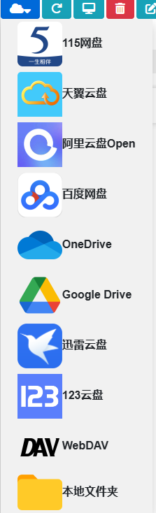

# 简介

**Alist**和**CloudDrive**都是流行的在线存储管理工具，主要用于统一管理和访问各种云存储资源。以下是它们的基本功能和作用介绍：

---

### 1. **Alist**

**Alist**是一款开源的文件列表程序，可以帮助用户将多种云存储服务整合在一个界面中进行管理。主要特点和作用如下：

- **支持多种云存储整合**：Alist 支持主流的云存储服务，如阿里云盘、OneDrive、Google Drive、百度网盘等，允许用户通过一个界面访问多个云盘。
- **便捷的文件共享**：用户可以通过 Alist 生成公开或私有的链接，以便共享云盘中的文件或文件夹。
- **高性能**：Alist 使用 Go 语言开发，性能较高，文件加载和传输速度快，适合管理大型文件。
- **自定义界面**：支持用户定制自己的文件列表界面，以便展示个性化内容。
- **跨平台使用**：支持在多种操作系统（Windows、Linux、macOS）和设备（PC、手机、平板）上使用。
  

Alist 的主要作用是让用户在统一界面下管理多个云存储账户，尤其适合需要频繁使用不同云盘的用户，减少切换应用的麻烦。

---

### 2. **CloudDrive**

**CloudDrive**是一款专注于云存储文件系统挂载的工具，通常用于将云存储映射到本地系统，作用如下：

- **本地挂载云盘**：CloudDrive 允许用户将云存储挂载成本地磁盘，类似于操作本地文件，可以直接读取、编辑、删除云端文件。
- **文件同步和传输**：提供实时或定时的文件同步功能，方便用户在本地和云端之间高效传输文件。
- **支持多种云盘协议**：支持常见的云存储协议，如 WebDAV、FTP、S3 等，使其兼容范围广泛。
- **适合大文件处理**：可以用于大文件的管理和上传，尤其适合视频、图片等多媒体文件的备份和传输。
- **集成自动化**：部分版本支持命令行操作，适合自动化任务和脚本控制。

CloudDrive 的核心作用在于简化用户对云端文件的操作体验，特别适合需要在本地直接操作云文件的用户，比如开发者、内容创作者等。

---

### 总结

- **Alist**：注重多云盘的文件管理和分享，适合需要集成管理多个云存储的用户。
- **CloudDrive**：偏向于本地**挂载**和文件系统的整合，使云盘文件操作类似本地文件，适合需要频繁在本地操作云端文件的用户。

两者都提升了云存储管理的便利性，但 Alist 更适合文件浏览和分享，而 CloudDrive 更适合本地文件挂载和管理。

# Alist

http://localhost:5244/

windows安装：[手动安装 | AList文档 (nn.ci)](https://alist.nn.ci/zh/guide/install/manual.html)

安卓版：[jing332/AListFlutter: AList 安卓版本，APK安装即用，无需Root或Termux。 (github.com)](https://github.com/jing332/AListFlutter)

添加云盘时参考[添加存储 | AList文档 (nn.ci)](https://alist.nn.ci/zh/guide/drivers/)


## Windows

### 开机自启动

直接使用 VBScript 文件（.vbs）来实现 AList 的开机自启动

1. **创建 VBScript 文件**：

   - 在 AList.exe 所在的目录下，新建一个文本文件，命名为 `start_alist.vbs`。

   - 编辑该文件，输入以下内容：

     ```vbscript
     Set ws = CreateObject("Wscript.Shell")
     ws.Run "alist.exe server", 0
     ```

   - 保存并关闭文件。

2. **将 VBScript 文件添加到开机启动项**：

   - 按 `Win + R`，输入 `shell:startup`，然后按回车，打开启动文件夹。
   - 将 `start_alist.vbs` 文件复制到该文件夹中。

完成上述步骤后，AList 将在每次系统启动时自动运行，且不会弹出命令提示符窗口。此方法利用 VBScript 直接调用 AList，可实现静默启动。

## Linux

[手动安装 | AList文档 (nn.ci)](https://alist.nn.ci/zh/guide/install/manual.html)

[下载](https://github.com/AlistGo/alist/releases)后解压

```shell
# 解压下载的文件，得到可执行文件：
tar -zxvf alist-xxxx.tar.gz
# 授予程序执行权限：
chmod +x alist
# 运行程序
./alist server

# 有随机生成和手动设置
# 随机生成一个密码
./alist admin random
# 手动设置一个密码 `NEW_PASSWORD`是指你需要设置的密码
./alist admin set NEW_PASSWORD
```

### 设置守护进程

`sudo nano /etc/systemd/system/alist.service`


```
[Unit]
Description=alist
After=network.target
 
[Service]
Type=simple
WorkingDirectory=path_alist
ExecStart=path_alist/alist server
Restart=on-failure
 
[Install]
WantedBy=multi-user.target
```

`path_alist`为alist解压后所在的文件夹

然后：

执行 `sudo systemctl daemon-reload` 重载配置，可以使用这些命令来管理程序：

- 启动: `sudo systemctl start alist`
- 关闭: `sudo systemctl stop alist`
- 配置开机自启: `sudo systemctl enable alist`
- 取消开机自启: `sudo systemctl disable alist`
- 状态: `sudo systemctl status alist`
- 重启: `sudo systemctl restart alist`

---

最后，打开`localhost:5244`即可

# 挂载为本地驱动器

可以在windows上直接进行访问

## windows自带（不推荐）

**不推荐，因为打开视频文件会卡**


将 AList 的 WebDAV 服务直接挂载为本地驱动器。以下是具体步骤：

1. **确保 AList 的 WebDAV 服务已启用**：
   - 在 AList 的设置中，确认 WebDAV 服务已正确配置并正在运行。
2. **修改 Windows 注册表，启用对 HTTP 的支持**：
   - 按 `Win + R`，输入 `regedit`，回车打开注册表编辑器。
   - 导航到 `HKEY_LOCAL_MACHINE\SYSTEM\CurrentControlSet\Services\WebClient\Parameters`。
   - 找到 `BasicAuthLevel`，将其值修改为 `2`。
   - 找到 `FileSizeLimitInBytes`，将其值修改为 `4294967295`（即 4GB），以解除文件大小限制。
   - 关闭注册表编辑器。
3. **重启 WebClient 服务**：
   - 按 `Win + R`，输入 `services.msc`，回车打开服务管理器。
   - 找到 `WebClient` 服务，右键选择“重新启动”。
4. **映射网络驱动器**：
   - 打开“文件资源管理器”，点击左侧的“此电脑”。
   - 在顶部菜单栏中，点击“计算机”选项卡，然后选择“映射网络驱动器”。
   - 在弹出的窗口中：
     - **驱动器**：选择一个未被占用的驱动器号。
     - **文件夹**：输入 AList 的 WebDAV 地址，例如 `http://<服务器地址>:5244/dav`。
     - 勾选“登录时重新连接”，以确保每次启动计算机时都能自动连接。
     - 如果需要使用特定的用户名和密码进行连接，勾选“使用其他凭据连接”。
   - 点击“完成”。
5. **输入凭据**：
   - 如果提示输入网络凭据，输入 AList 的用户名和密码。
   - 勾选“记住我的凭据”，以避免每次连接时都需要重新输入。
   - 点击“确定”。

## CloudDrive2

官网[CloudDrive - Home (clouddrive2.com)](https://www.clouddrive2.com/)

http://localhost:19798/

支持的云盘如下

 

我最常用的是夸克和迅雷，所以夸克通过WebDAV来实现，迅雷直接用CloudDrive

免费的CloudDrive账户只能挂载一个以及两个云盘（对我来说够了，其他如百度云盘都可以通过WebDAV来实现）

> 注意：挂载时选择本地磁盘可以打开文件共享，实现SMB

